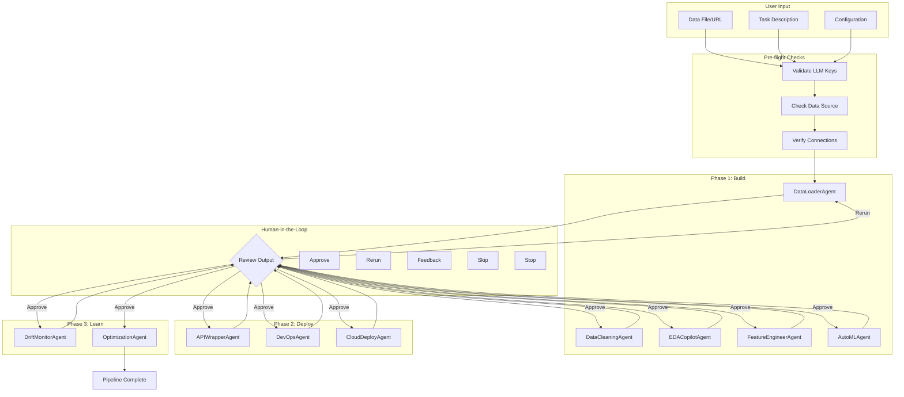
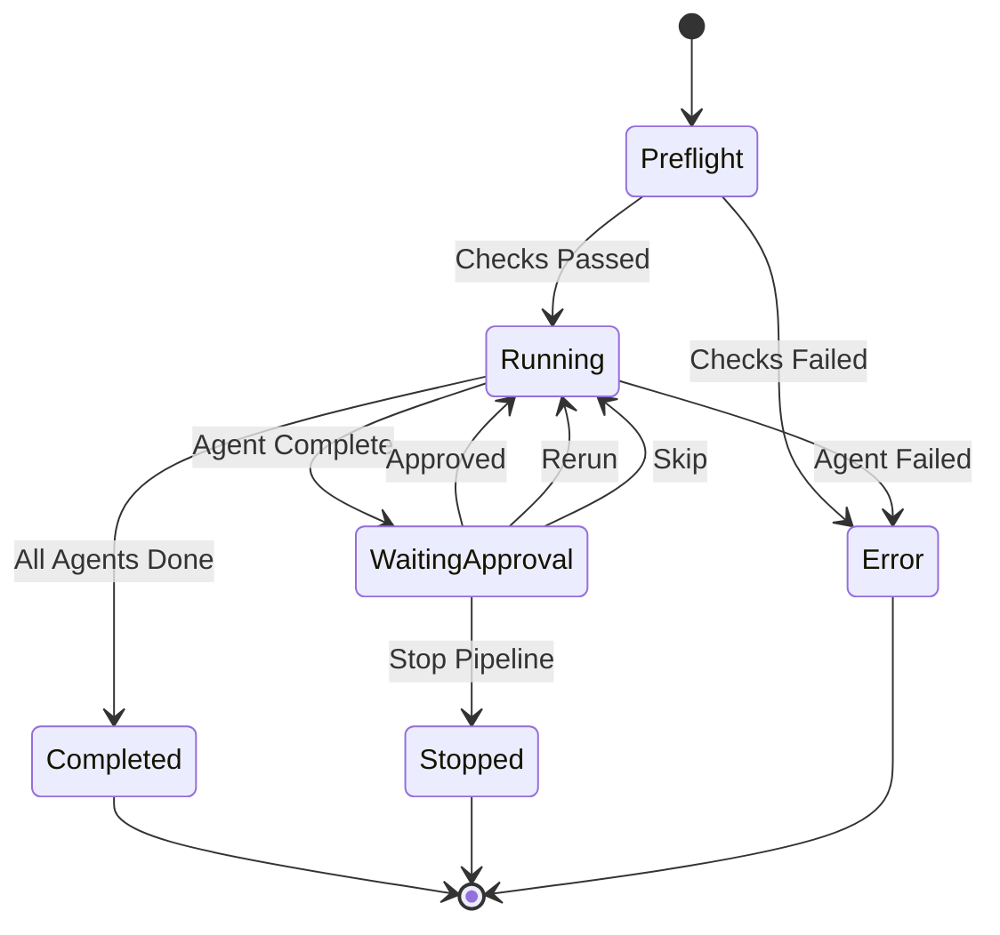
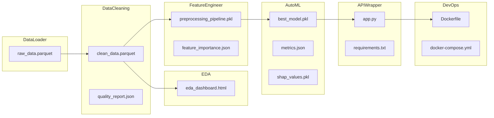

# AgentDS Architecture

**Comprehensive Technical Documentation**

Author: Malav Patel  
  
Last Updated: January 2026

---

## Table of Contents

1. [System Overview](#system-overview)
2. [Architecture Diagrams](#architecture-diagrams)
3. [Agent Architecture](#agent-architecture)
4. [Data Flow](#data-flow)
5. [LLM Gateway](#llm-gateway)
6. [Human-in-the-Loop](#human-in-the-loop)
7. [State Management](#state-management)
8. [Deployment Architecture](#deployment-architecture)

---

## System Overview

AgentDS is a multi-agent data science automation system that orchestrates 10 specialized agents across three phases:

- **Build Phase**: Data loading, cleaning, EDA, feature engineering, model training
- **Deploy Phase**: API generation, Docker configuration, cloud deployment
- **Learn Phase**: Drift monitoring, automatic prompt optimization (APO)

### Key Technologies

| Component | Technology | Version |
|-----------|------------|---------|
| Orchestration | LangGraph | 1.0.7 |
| LLM Gateway | LiteLLM | 1.81.5 |
| Data Engine | Polars + DuckDB | 1.37.0 / 1.4.4 |
| Web Interface | Gradio | 5.49.1 |
| REST API | Litestar | 2.14.x |
| Caching | Redis | 5.2.x |
| Job Queue | Redis Queue (RQ) | Latest |
| APO | Agent Lightning | 0.2.x |

---

## Architecture Diagrams

### High-Level System Architecture

```
+===========================================================================+
|                              AgentDS Architecture                                    |
+===========================================================================+

                              +-----------------+
                              |   USER INPUTS   |
                              | File/URL/Config |
                              +--------+--------+
                                       |
                   +-------------------+-------------------+
                   |                                       |
          +--------v--------+                    +---------v--------+
          |   GRADIO WEB    |                    |   N8N WEBHOOKS   |
          |   Interface     |                    |   REST API       |
          |   Port: 7860    |                    |   Port: 8000     |
          +--------+--------+                    +---------+--------+
                   |                                       |
                   +-------------------+-------------------+
                                       |
                              +--------v--------+
                              |  PRE-FLIGHT     |
                              |  VALIDATION     |
                              |  - LLM Keys     |
                              |  - Data Source  |
                              |  - Connections  |
                              +--------+--------+
                                       |
                              +--------v--------+
                              |  LANGGRAPH      |
                              |  ORCHESTRATOR   |
                              |  State Machine  |
                              +--------+--------+
                                       |
         +-----------------------------+-----------------------------+
         |                             |                             |
+--------v--------+          +--------v--------+          +----------v--------+
|  PHASE 1: BUILD |          |  PHASE 2: DEPLOY|          |  PHASE 3: LEARN   |
|  Agents 1-5     |          |  Agents 6-8     |          |  Agents 9-10      |
+-----------------+          +-----------------+          +-------------------+
| DataLoaderAgent |          | APIWrapperAgent |          | DriftMonitorAgent |
| DataCleanAgent  |          | DevOpsAgent     |          | OptimizationAgent |
| EDACopilotAgent |          | CloudDeployAgent|          | (Agent Lightning) |
| FeatureEngAgent |          +-----------------+          +-------------------+
| AutoMLAgent     |
+-----------------+
         |                             |                             |
         +-----------------------------+-----------------------------+
                                       |
                              +--------v--------+
                              |  LITELLM        |
                              |  GATEWAY        |
                              |  100+ Providers |
                              +--------+--------+
                                       |
         +-----------------------------+-----------------------------+
         |                             |                             |
+--------v--------+          +--------v--------+          +----------v--------+
|     OPENAI      |          |   ANTHROPIC     |          |   OLLAMA (LOCAL)  |
|   gpt-4o        |          |   claude-3.5    |          |   llama3.1:70b    |
|   gpt-4o-mini   |          |   claude-3-opus |          |   mistral:7b      |
+-----------------+          +-----------------+          +-------------------+
         |                             |                             |
         +--------+--------------------+--------------------+--------+
                  |                    |                    |
         +--------v--------+  +--------v--------+  +--------v--------+
         |  REDIS CACHE    |  |  ARTIFACT STORE |  |  MLFLOW         |
         |  Results/State  |  |  Files/Models   |  |  Experiments    |
         +-----------------+  +-----------------+  +-----------------+
```

### Agent Flow Diagram (Mermaid)



### State Machine Diagram (Mermaid)



---

## Agent Architecture

### Agent Hierarchy

```
BaseAgent (Abstract)
    |
    +-- DataLoaderAgent      [BUILD]  [LOW]      Temperature: 0.0
    +-- DataCleaningAgent    [BUILD]  [LOW]      Temperature: 0.0
    +-- EDACopilotAgent      [BUILD]  [MEDIUM]   Temperature: 0.1
    +-- FeatureEngineerAgent [BUILD]  [MEDIUM]   Temperature: 0.0
    +-- AutoMLAgent          [BUILD]  [HIGH]     Temperature: 0.0
    +-- APIWrapperAgent      [DEPLOY] [HIGH]     Temperature: 0.0
    +-- DevOpsAgent          [DEPLOY] [MEDIUM]   Temperature: 0.0
    +-- CloudDeployAgent     [DEPLOY] [MEDIUM]   Temperature: 0.0
    +-- DriftMonitorAgent    [LEARN]  [LOW]      Temperature: 0.0
    +-- OptimizationAgent    [LEARN]  [CRITICAL] Temperature: 0.2
```

### Agent Input/Output Matrix

| Agent | Input | Output | Complexity |
|-------|-------|--------|------------|
| DataLoaderAgent | File path, URL, SQL | raw_data.parquet | LOW |
| DataCleaningAgent | raw_data.parquet | clean_data.parquet, quality_report.json | LOW |
| EDACopilotAgent | clean_data.parquet | eda_dashboard.html | MEDIUM |
| FeatureEngineerAgent | clean_data.parquet | preprocessing_pipeline.pkl | MEDIUM |
| AutoMLAgent | processed_data | best_model.pkl, metrics.json | HIGH |
| APIWrapperAgent | best_model.pkl | app.py, requirements.txt | HIGH |
| DevOpsAgent | app.py | Dockerfile, docker-compose.yml | MEDIUM |
| CloudDeployAgent | Docker image | Live API URL | MEDIUM |
| DriftMonitorAgent | reference_data, current_data | drift_report.json | LOW |
| OptimizationAgent | feedback, drift_alerts | optimized_prompts.json | CRITICAL |

---

## Data Flow

### Data Processing Pipeline

```
+-------------------+     +-------------------+     +-------------------+
|   INPUT DATA      |     |   PROCESSING      |     |   OUTPUT          |
+-------------------+     +-------------------+     +-------------------+
|                   |     |                   |     |                   |
| CSV/Parquet/JSON  | --> | Polars DataFrame  | --> | Artifacts Store   |
| S3/GCS/Azure      |     | DuckDB Queries    |     | MLflow Tracking   |
| PostgreSQL/MySQL  |     | Cleanlab Quality  |     | Redis Cache       |
| REST API          |     | XGBoost/LightGBM  |     |                   |
|                   |     | Optuna HPO        |     |                   |
+-------------------+     +-------------------+     +-------------------+
```

### Artifact Flow



---

## LLM Gateway

### Provider Architecture

```
+===========================================================================+
|                         LiteLLM Universal Gateway                          |
+===========================================================================+
|                                                                           |
|  +------------------+  +------------------+  +------------------+          |
|  | TIER 1: CLOUD    |  | TIER 2: SPECIAL  |  | TIER 3: LOCAL    |          |
|  +------------------+  +------------------+  +------------------+          |
|  | OpenAI           |  | xAI (Grok)       |  | Ollama           |          |
|  | Anthropic        |  | DeepSeek         |  | vLLM             |          |
|  | Google Vertex    |  | Mistral          |  | LlamaCPP         |          |
|  | AWS Bedrock      |  | Cohere           |  |                  |          |
|  | Azure OpenAI     |  | Groq             |  |                  |          |
|  +------------------+  | Together AI      |  +------------------+          |
|                        | Fireworks        |                               |
|                        | Perplexity       |                               |
|                        +------------------+                               |
|                                                                           |
|  +---------------------------------------------------------------------+  |
|  |                        FALLBACK CHAIN                               |  |
|  |  Primary --> Fallback 1 --> Fallback 2 --> Fallback 3 --> Local    |  |
|  |  gpt-4o --> claude-3.5 --> gemini-1.5 --> groq/llama --> ollama    |  |
|  +---------------------------------------------------------------------+  |
|                                                                           |
+===========================================================================+
```

### Temperature Configuration

| Agent | Temperature | Rationale |
|-------|-------------|-----------|
| DataLoaderAgent | 0.0 | Deterministic data handling |
| DataCleaningAgent | 0.0 | Reproducible cleaning operations |
| EDACopilotAgent | 0.1 | Slight creativity for insights |
| FeatureEngineerAgent | 0.0 | Deterministic transformations |
| AutoMLAgent | 0.0 | Reproducible model selection |
| APIWrapperAgent | 0.0 | Consistent code generation |
| DevOpsAgent | 0.0 | Standard configurations |
| CloudDeployAgent | 0.0 | Reliable deployments |
| DriftMonitorAgent | 0.0 | Accurate metrics |
| OptimizationAgent | 0.2 | Creative prompt rewriting |

---

## Human-in-the-Loop

### Approval Flow

```
+-----------------------------------------------------------------------+
|                     HUMAN-IN-THE-LOOP WORKFLOW                        |
+-----------------------------------------------------------------------+
|                                                                       |
|   Agent Completes                                                     |
|        |                                                              |
|        v                                                              |
|   +--------------------+                                              |
|   | Display Output     |                                              |
|   | - Summary          |                                              |
|   | - Artifacts        |                                              |
|   | - Diff View        |                                              |
|   | - ETA              |                                              |
|   +--------------------+                                              |
|        |                                                              |
|        v                                                              |
|   +--------------------+                                              |
|   | User Action        |                                              |
|   +--------------------+                                              |
|   | [Approve]     --> Continue to next agent                          |
|   | [Re-run]      --> Execute same agent again                        |
|   | [Feedback]    --> Re-run with text instructions                   |
|   | [Skip]        --> Move to next agent without output               |
|   | [Stop]        --> Terminate pipeline                              |
|   | [Download]    --> Download current artifacts                      |
|   | [Rollback]    --> Return to previous checkpoint                   |
|   +--------------------+                                              |
|                                                                       |
+-----------------------------------------------------------------------+
```

### Actions Available

```python
class AgentAction(str, Enum):
    APPROVE_AND_CONTINUE = "approve_and_continue"
    RERUN = "rerun"
    RERUN_WITH_FEEDBACK = "rerun_with_feedback"
    SKIP = "skip"
    STOP_PIPELINE = "stop_pipeline"
    DOWNLOAD_OUTPUT = "download_output"
    ROLLBACK = "rollback"
```

---

## State Management

### LangGraph State Schema

```python
class PipelineState(TypedDict):
    # Identification
    job_id: str
    task_description: str
    data_source: str
    output_destination: str
    
    # Execution State
    current_phase: str          # build, deploy, learn
    current_agent: str          # Agent name
    agent_results: Dict[str, Dict[str, Any]]
    
    # Human-in-the-Loop
    awaiting_approval: bool
    user_action: Optional[str]
    user_feedback: Optional[str]
    
    # Error Handling
    error: Optional[str]
    retry_count: int
    
    # Completion
    completed: bool
    final_outputs: Dict[str, Any]
```

### Checkpoint Storage

```
+-----------------------------------------------------------------------+
|                      CHECKPOINT ARCHITECTURE                          |
+-----------------------------------------------------------------------+
|                                                                       |
|   +-------------------+                                               |
|   | LangGraph         |                                               |
|   | MemorySaver       | <-- In-memory checkpoints                     |
|   +-------------------+                                               |
|           |                                                           |
|           v                                                           |
|   +-------------------+                                               |
|   | Redis Storage     | <-- Persistent checkpoints                    |
|   | agentds:chkpt:*   |                                               |
|   +-------------------+                                               |
|           |                                                           |
|           v                                                           |
|   +-------------------+                                               |
|   | File System       | <-- Backup checkpoints                        |
|   | /checkpoints/     |                                               |
|   +-------------------+                                               |
|                                                                       |
+-----------------------------------------------------------------------+
```

---

## Deployment Architecture

### Container Architecture

```
+===========================================================================+
|                        DOCKER DEPLOYMENT                                   |
+===========================================================================+
|                                                                           |
|   +-------------------+     +-------------------+     +------------------+ |
|   |  agentds-web      |     |  agentds-api      |     |  agentds-worker  | |
|   |  Gradio UI        |     |  Litestar API     |     |  RQ Worker       | |
|   |  Port: 7860       |     |  Port: 8000       |     |  Background Jobs | |
|   +-------------------+     +-------------------+     +------------------+ |
|           |                         |                         |           |
|           +-------------------------+-------------------------+           |
|                                     |                                     |
|                          +----------v----------+                          |
|                          |   agentds-redis     |                          |
|                          |   Cache + Queue     |                          |
|                          |   Port: 6379        |                          |
|                          +---------------------+                          |
|                                     |                                     |
|           +-------------------------+-------------------------+           |
|           |                         |                         |           |
|   +-------v-------+        +--------v--------+       +--------v--------+  |
|   | agentds-mlflow|        | agentds-ollama  |       | Volume Mounts   |  |
|   | Tracking      |        | Local LLM       |       | - outputs/      |  |
|   | Port: 5000    |        | Port: 11434     |       | - logs/         |  |
|   +---------------+        +-----------------+       | - config/       |  |
|                                                      +-----------------+  |
|                                                                           |
+===========================================================================+
```

### Kubernetes Architecture

```yaml
# Deployment topology
Namespace: agentds
|
+-- Deployment: agentds-web (replicas: 2)
|   +-- Service: agentds-web-svc (ClusterIP)
|   +-- HPA: min=2, max=10, cpu=70%
|
+-- Deployment: agentds-api (replicas: 2)
|   +-- Service: agentds-api-svc (ClusterIP)
|   +-- HPA: min=2, max=10, cpu=70%
|
+-- StatefulSet: redis (replicas: 1)
|   +-- Service: redis-svc (ClusterIP)
|   +-- PVC: redis-data (10Gi)
|
+-- Ingress: agentds-ingress
    +-- Host: agentds.example.com
    +-- TLS: letsencrypt
```

---

## API Endpoints

### REST API Summary

| Endpoint | Method | Description |
|----------|--------|-------------|
| `/api/health` | GET | Health check |
| `/api/pipeline/start` | POST | Start pipeline |
| `/api/pipeline/status/{job_id}` | GET | Get status |
| `/api/pipeline/cancel/{job_id}` | POST | Cancel pipeline |
| `/api/pipeline/action/{job_id}` | POST | Human action |
| `/api/agent/run` | POST | Run single agent |
| `/api/jobs` | GET | List all jobs |
| `/api/jobs/{job_id}` | GET | Get job details |
| `/api/config` | GET | Get configuration |
| `/api/config/update` | POST | Update config |

---

## Security Considerations

### API Key Management

```
+-----------------------------------------------------------------------+
|                     SECRETS MANAGEMENT                                |
+-----------------------------------------------------------------------+
|                                                                       |
|   Environment Variables (Development):                                |
|   - .env file (git-ignored)                                           |
|   - Docker secrets                                                    |
|                                                                       |
|   Kubernetes Secrets (Production):                                    |
|   - kubectl create secret generic agentds-secrets                     |
|   - External Secrets Operator                                         |
|   - HashiCorp Vault integration                                       |
|                                                                       |
|   Cloud Provider (Enterprise):                                        |
|   - AWS Secrets Manager                                               |
|   - GCP Secret Manager                                                |
|   - Azure Key Vault                                                   |
|                                                                       |
+-----------------------------------------------------------------------+
```

---

## Performance Considerations

### Optimization Strategies

1. **Caching**: Redis caching for LLM responses and intermediate results
2. **Streaming**: Polars lazy evaluation for large datasets
3. **Batching**: Batch LLM requests where possible
4. **Sampling**: Automatic sampling for datasets > 1M rows
5. **Checkpointing**: Save state after each agent for recovery

### Resource Requirements

| Component | CPU | Memory | GPU |
|-----------|-----|--------|-----|
| Web Interface | 1 core | 1 GB | - |
| API Server | 1 core | 1 GB | - |
| Worker | 2 cores | 4 GB | Optional |
| Redis | 0.5 core | 512 MB | - |
| Ollama | 4 cores | 16 GB | Recommended |

---

## Monitoring and Observability

### Metrics

- Pipeline execution time
- Agent success/failure rates
- LLM cost tracking
- Token usage per agent
- Drift detection scores

### Logging

- Structured JSON logging (structlog)
- Log levels: DEBUG, INFO, WARNING, ERROR
- Context propagation (job_id, agent)
- Log rotation and retention

---

*This document is maintained as part of AgentDS*

*Author: Malav Patel | malav.patel203@gmail.com*
